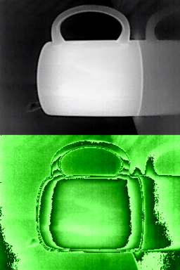
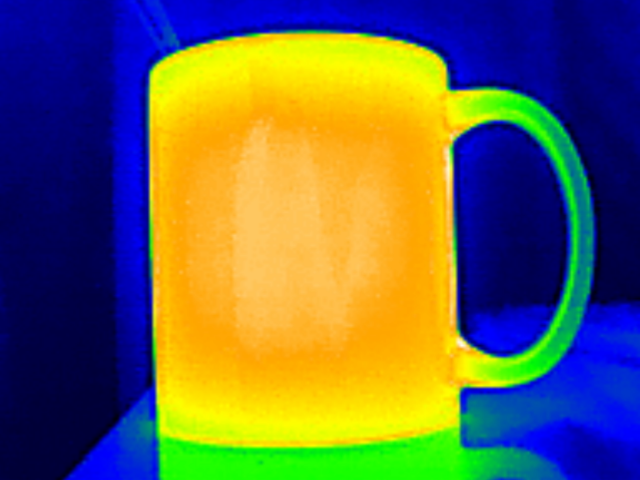

# Thermal Color Camera

A script that converts the Topdon TC001 thermal camera (0bda:5830) raw gray/green output into a virtual color camera (/dev/video*) for webcam apps on Linux, with NUC/FFC auto-shutter control.

 

_On the left: raw output, on the right: color output._

## Features

- Auto-detects TC001 by USB VID:PID (`0bda:5830`)
- Creates a virtual camera named `TC001 Color Camera [<id>]` (ID key is 10 lowercase hex characters)
- Converts thermal image to false color (`black -> blue -> green -> yellow -> orange -> white`)
- Uses `udev -> systemd` hotplug flow via a short launcher unit (start on plug, stop on unplug) if installed
- Writes thermal stats to `/dev/shm/sensors/camera/thermal/temperature_*`: `min`/`median`/`max` temperatures in deg C across the output image.
- Writes additional min/median/max temperatures for 9 zones of the output image
- NUC/FFC auto-shutter can be disabled after a timeout (30s default)

## Tested on

- Debian 12
- Debian 13

## Usage

Requirements:
- `python3`
- `modprobe`
- `ffmpeg`
- `v4l2loopback` kernel module
- `v4l2loopback-ctl` (Debian package: `v4l2loopback-utils`)

Run directly:

```bash
sudo ./tc001-color-camera.py
```

Then select the `TC001 Color Camera [<id>]` device in your camera app.

### Options

| Argument | Description |
|---|---|
| `--src-video-index` | Source TC001 device index, e.g. `2` for `/dev/video2` (default: auto-detect) |
| `--dst-video-index` | Virtual camera device index, e.g. `3` for `/dev/video3` (default: lowest free) |
| `--fps` | Capture/output FPS (default: `30`, clamped to `1..60`) |
| `--dst-resolution` | Output `WxH` (default: `640x480`, each dimension clamped to `128..2048`) |
| `--rotate` | `none`, `0`, `90`, `180`, `270` (default: `90`) |
| `--ffc-disable-after` | Disable TC001 NUC/FFC auto-shutter after N seconds (default: `30`), `none` or no value keeps it enabled |
| `--temps-every` | Write temperatures every N seconds (default: `1`, clamped to `0.1..3600`) |

Examples:

```bash
sudo ./tc001-color-camera.py --rotate none
sudo ./tc001-color-camera.py --dst-resolution 1280x720 --fps 30
sudo ./tc001-color-camera.py --ffc-disable-after none
```

### Temperature readings

Written to `/dev/shm/sensors/camera/thermal/`:

- `temperature_min`
- `temperature_median`
- `temperature_max`
- `temperature_zone{1..9}_{min,median,max}`

Zone layout (`1/4, 1/2, 1/4` split in each direction; zone 5 is largest):

```text
123
456
789
```

Zone positions follow the cropped output orientation.

### Cleanup

The temperature readings files are cleared on exit/unplug.

The virtual camera device is removed on exit/unplug as well, however, except the case if the virtual camera was in use at that moment: the Linux kernel doesn't allow removing such a device while in use. You can run a cleanup script for the unused virtual cameras if this happens:

```bash
sudo ./tc001-color-camera-cleanup.py
```

Or you can install the script as described below - then the "orphaned" unused virtual devices will be removed or reused every time a physical TC001 device is plugged in.

## Installation

After installation, hotplug is supported: the virtual color camera is created when the physical camera device is connected, and removed when disconnected.

Additional requirements:
- `udev` + `systemd`/`systemctl`

1. Install scripts:

```bash
sudo install -m 0755 tc001-color-camera.py /usr/local/bin/tc001-color-camera
sudo install -m 0755 tc001-color-camera-hotplug.py /usr/local/bin/tc001-color-camera-hotplug
sudo install -m 0755 tc001-color-camera-cleanup.py /usr/local/bin/tc001-color-camera-cleanup
sudo install -m 0755 tc001-color-camera-common.py /usr/local/bin/tc001-color-camera-common.py
```

2. Install `udev` rule and `systemd` unit:

```bash
sudo install -m 0644 udev/99-tc001-color-camera.rules /etc/udev/rules.d/99-tc001-color-camera.rules
sudo install -m 0644 systemd/tc001-color-camera-launch@.service /etc/systemd/system/tc001-color-camera-launch@.service
sudo install -m 0644 systemd/tc001-color-camera@.service /etc/systemd/system/tc001-color-camera@.service
sudo udevadm control --reload-rules
sudo systemctl daemon-reload
```

3. Replug the camera. A new `/dev/videoN` virtual camera should appear.

## Service args override

To change service arguments (for example `--rotate`, `--dst-resolution`, or `--fps`):

```bash
sudo install -d -m 0755 /etc/systemd/system/tc001-color-camera@.service.d
cat <<'EOF' | sudo tee /etc/systemd/system/tc001-color-camera@.service.d/override.conf >/dev/null
[Service]
ExecStart=
ExecStart=/usr/local/bin/tc001-color-camera --src-video-index %i $TC001_LAUNCH_ARGS --rotate none --dst-resolution 640x480 --fps 3 --ffc-disable-after 30
EOF
sudo systemctl daemon-reload
```

If an instance is running, restart it; otherwise replug the camera.

## Logs

```bash
journalctl -u 'tc001-color-camera-launch@*.service' -u 'tc001-color-camera@*.service' -f
```

## Uninstall

Stop running instance(s):

```bash
systemctl list-units 'tc001-color-camera@*.service'
sudo systemctl stop tc001-color-camera@X.service
```

Remove hotplug integration:

```bash
sudo rm -f /etc/udev/rules.d/99-tc001-color-camera.rules /etc/systemd/system/tc001-color-camera-launch@.service /etc/systemd/system/tc001-color-camera@.service
sudo udevadm control --reload-rules
sudo systemctl daemon-reload
```

Remove script:

```bash
sudo rm -f /usr/local/bin/tc001-color-camera /usr/local/bin/tc001-color-camera-hotplug /usr/local/bin/tc001-color-camera-cleanup /usr/local/bin/tc001-color-camera-common.py
```
